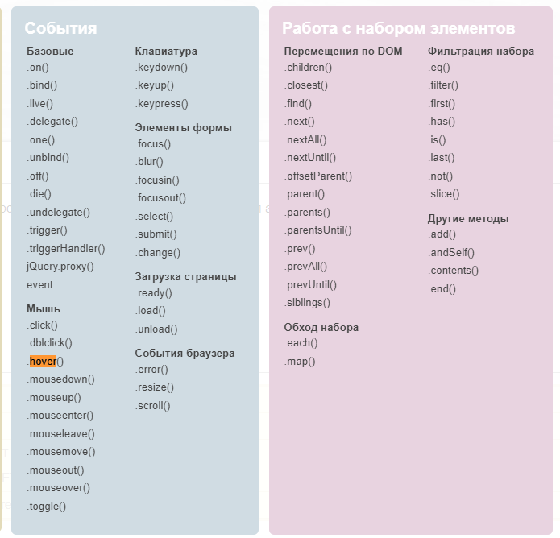

## Jquery Practice

Проект с использованием библиотеки JQuery.


### Установка библиотеки
```
npm i jquery --save
```

### Запуск Webpack
```
npx webpack
```

### Описание

Импорт библиотеки:<br>
`import $ from 'jquery';`


### Карта функций


### Ссылка на карту функций
<https://jquery.page2page.ru/index.php5/Ajax>


